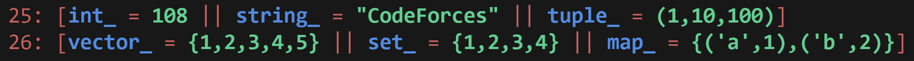

# C++ Debug Template
Simplify variable tracking across functions and loops!

## Simple Usage 
```c++
int mat[3][5]{};
vector<int> v;
for (int i = 1; i <= 3; i++)
{
    v.push_back(i * i);
    debug(i, v);
}
debug(mat);

// stderr
23: [i = 1 || v = {1}]
23: [i = 2 || v = {1,4}]
23: [i = 3 || v = {1,4,9}]
25: [mat = 
~~~~~
0 {0,0,0,0,0}
1 {0,0,0,0,0}
2 {0,0,0,0,0}
~~~~~
]
```
This template supports datatypes such as:

- Primitive: `int`, `char`, `bool`, `long long int` etc.
- STL: `pair`, `tuple`, `vector`, `set`, `oset`, `map`, `omap`,`stack`, `queue`, `priority_queue`, `bitset` etc.
- Arrays of all datatypes: `int arr[]`, `bool arr[]`, `vector<int> adj[]` etc.
- Matrix: `int dp[100][200]`, `vector<vector<bool>> vis(100, vector<bool> (200, 0))` etc.
- Arrays that have been decayed or declared at runtime `int arr[n]`.
- Rvalue Literals like `"Hello"`, `false`, `'z'`, `isSafe(i, j), dfs(u)` etc. 
- User defined structs / classes like `Point`, `Node`. 
- Even complicated nested datatypes like: `map<string, vector<pair<char, unordered_set<long long>>>> WHATTT;` etc.

Coloured version of this template is also supported. (Terminal Only)



You can use it on your computer when doing coding challenges on sites like **CodeForces**. <br>
Additionally, you can use it in online coding environments like **LeetCode** for practicing data structures and algorithms.

## How to use it?

Let's say you have different datatypes such as:
```c++
char Char = 'A';
int arr[] = {1, 2, 3, 4};
bitset<8> Bitset(100);
map<string, int> map_String_Int = {{"apple", 5}, {"banana", 3}, {"orange", 7}};
```
You can debug them like this `debug(var1, var2, var3, var4, ...);`
```c++ 
debug(Char, arr, Bitset, map_String_Int);

// Output
21: [Char = 'A' || arr = {1,2,3,4} || Bitset = 01100100 || map_String_Int = {("apple",5),("banana",3),("orange",7)}]
```
If you have user defined structs / classes, you just need to make a `print()` function, and use `debug(...)` like you do :)
```c++
void print(Point ob) { cerr << "(" << ob.x << "," << ob.y << ")"; }
```

In instances where array have decayed into pointer, or you declared array at runtime, use `debugArr(arr, n)`;

**Note:**


- You don't need to remove `debug(var, ...)` statements in your code when submitting it. <br>
- On platforms like Codeforces, there's a macro called `ONLINE_JUDGE` that's defined, automatically disregarding all your debug statements. This ensures your solution will be accepted unless there's a logical error.
  
## How to Setup?

- Copy this template into your own templates. The output will be directed to the stderr stream.
- Alternatively you can make a separate header file and include this into your template.
  ```c++
  #ifndef ONLINE_JUDGE
  #include "template.cpp"
  #else
  #define debug(...)
  #define debugArr(...)
  #endif
  ```
- When using it for LeetCode uncomment `#define cerr cout` and before submitting change `#ifndef` to `#ifdef` to ignore `debug(...);`. For convenience, after changing it, copy it, and keep it pinned in your clipboard for repetitive use.

**For Complete Beginners who need step by step tutorial (using VS Code), follow these steps:**
<details>
  <summary> <strong> Steps </strong> </summary>
  
  1. Open VS Code
  2. In your workspace, create a file _template.cpp_
  3. Copy content of one of my _template.cpp_ into your _template.cpp_
  4. Press **Ctrl + Shift + P** to open Command Pallete
  5. Search **Configure User Snippet** and click on _cpp.json_
  6. Now copy the content of my _cpp.json_ into your _cpp.json_ file
  7. Now you have configured your user snippets. Create a _main.cpp_ file and type **wow** and press TAB!!! Magic!!! <br>

  Additionally, you can install `Competitive Programming Helper` extension from VS Code to make your journey easy.

  Now for LeetCode

  1. Uncomment `#define cerr cout` and copy this template
  2. Keep it pinned in your clipboard. If you are using windows, you can press **Win + V** to open clipboard.
  3. When solving DSA problems in LeetCode, paste this above `class Solution` and use debug normally.
  4. Before submitting, change `#ifndef` to `#ifdef` to ignore `debug(...);`.
</details>
